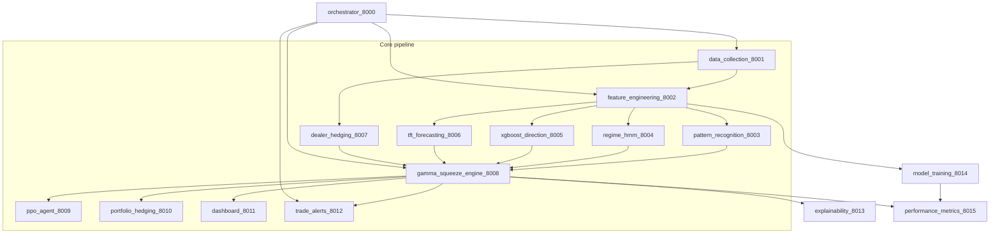

# System Architecture — Gamma Squeeze Platform (Microservices)

**Phase 1 (this document):** lock the modular microservice DAG, independence contract,
service map, and local/compose run story. **Phase 2** locks the programming stack in
[docs/PROGRAMMING_STACK.md](docs/PROGRAMMING_STACK.md). Later phases deepen data, models, and ops.

## Phased delivery

| Phase | Topic | Status |
|-------|--------|--------|
| 1 | **System Architecture** | Complete — this document + `services/*` independence |
| 2 | **Programming Stack** | Complete — [docs/PROGRAMMING_STACK.md](docs/PROGRAMMING_STACK.md) + `gamma_squeeze.stack.inventory` |
| 3 | **Data Sources** | Complete — [docs/DATA_SOURCES.md](docs/DATA_SOURCES.md) + `gamma_squeeze.data_sources.catalog` |
| 4 | **Feature Engineering Engine** | Complete — Dealer Positioning, Options Metrics, Technical Indicators, Macro Features ([docs/FEATURE_ENGINEERING.md](docs/FEATURE_ENGINEERING.md)) |
| 5 | **Hidden Markov Model** | Complete — 16 named regimes + current/transition/next/confidence ([docs/REGIME_HMM.md](docs/REGIME_HMM.md)) |
| 6 | **XGBoost Direction Model** | Complete — 1/3/5/10/20d class/reg/proba + CV/Optuna/SHAP ([docs/XGBOOST_DIRECTION.md](docs/XGBOOST_DIRECTION.md)) |
| 7 | **Temporal Fusion Transformer** | Complete — 8 targets × 1/2/3/5/10d quantiles + attention ([docs/TFT_FORECASTING.md](docs/TFT_FORECASTING.md)) |
| 8 | **Technical Pattern Recognition** | Complete — CNN/LSTM/Transformer hybrid + candle library ([docs/PATTERN_RECOGNITION.md](docs/PATTERN_RECOGNITION.md)) |
| 9 | **Dealer Hedging Engine** | Complete — flow map, demand curve, inventory/exhaustion/flip ([docs/DEALER_HEDGING.md](docs/DEALER_HEDGING.md)) |
| 10 | **Gamma Squeeze Engine** | Complete — composite P/magnitude/duration from HMM/XGB/TFT/dealer/patterns/macro/sentiment ([docs/GAMMA_SQUEEZE_ENGINE.md](docs/GAMMA_SQUEEZE_ENGINE.md)) |
| 11 | **PPO Reinforcement Learning Agent** | Complete — SB3 PPO state/actions/reward ([docs/PPO_AGENT.md](docs/PPO_AGENT.md)) |
| 12 | **Portfolio Hedging Engine** | Complete — 13 structures × Return/Risk/Capital/Margin optimize ([docs/PORTFOLIO_HEDGING.md](docs/PORTFOLIO_HEDGING.md)) |
| 13 | **Explainability Engine** | Complete — SHAP/attention/FI/CF/PDP/trace/confidence; every prediction has WHY ([docs/EXPLAINABILITY.md](docs/EXPLAINABILITY.md)) |
| 14 | Visualization Dashboard | Deferred |
| 15 | **Alert Engine** | Complete — 9 triggers × WS/Email/SMS/Discord/Slack/Webhook ([docs/ALERT_ENGINE.md](docs/ALERT_ENGINE.md)) |
| 16 | **Model Training** | Complete — WF/TSS, Optuna, ES, MLflow, versions, auto-retrain, feature/pred/concept drift ([docs/MODEL_TRAINING.md](docs/MODEL_TRAINING.md)) |
| 17 | **Performance Metrics** | Complete — Accuracy→ES (classif/reg/trading/tail) ([docs/PERFORMANCE_METRICS.md](docs/PERFORMANCE_METRICS.md)) |
| 18 | **API Endpoints** | Complete — `/options`…`/retrain` + `/health` + `/docs` ([docs/API_ENDPOINTS.md](docs/API_ENDPOINTS.md)) |
| 19 | **Coding Standards** | Complete — DI, typing, tests, async, modular models, YAML+env, logging/metrics, docs, reproducibility ([docs/CODING_STANDARDS.md](docs/CODING_STANDARDS.md)) |

### Phase 1 complete criteria

- Canonical pipeline matches Data Collection → Trade Alert API (below)
- Every module exposes an independent FastAPI API (`/health`, `/ready`, `/docs`)
- Each module can run alone via `uvicorn` or Docker
- Orchestrator `/v1/pipeline/run` executes the ordered DAG with per-stage status
- Architecture tests pass without live Alpaca or SSD

### Phase 2 complete criteria

- Locked Language / Frameworks / Backend / Streaming / Deployment / Visualization sets
- `pyproject.toml` + `requirements*.txt` cover every locked library
- Orchestrator `GET /v1/stack/inventory` and `GET /v1/stack/health`
- Docker Compose + Kubernetes manifests + Next.js viz deps present
- Stack tests pass without GPU or live infra

### Phase 3 complete criteria

- Locked adapters for Options (Alpaca/Schwab/IBKR/OPRA/Polygon/CBOE), Market, Macro, Structure, Corporate, Calendar
- Data Collection `/v1/adapters` reports `phase: 3` and `locked_ok: true`
- Adapter tests pass without live broker keys

## Locked core pipeline (ordered)

```
Data Collection (8001)
        ↓
Feature Engineering (8002)
        ↓
Technical Pattern Recognition (8003)
        ↓
Market Regime Detection (Hidden Markov Model) (8004)
        ↓
XGBoost Direction Prediction (8005)
        ↓
Temporal Fusion Transformer Forecasting (8006)
        ↓
Dealer Hedging Simulation Engine (8007)
        ↓
Gamma Squeeze Probability Engine (8008)
        ↓
Reinforcement Learning Trading Agent (PPO) (8009)
        ↓
Portfolio Hedging Engine (8010)
        ↓
Visualization Dashboard (8011)
        ↓
Trade Alert API (8012)
```

Constant: `CORE_PIPELINE_STEPS` in [`services/common/pipeline.py`](services/common/pipeline.py).

Every module is an **independent FastAPI microservice**: own process, own OpenAPI
(`/docs`, `/openapi.json`), own `/health` + `/ready`, and runnable without the others
(degraded responses when upstreams are offline).

## Architecture companions

Registered alongside the core pipeline; detailed in later phases:

| Service | Port | Role |
|---------|------|------|
| API Gateway / Orchestrator | 8000 | Unified REST + DAG fan-in |
| Explainability Engine | 8013 | SHAP / attention / PDP / counterfactuals |
| Model Training | 8014 | Walk-forward / HPO / drift / versioning |
| Performance Metrics | 8015 | Classification, regression, trading, tail risk |

## Programming stack (Phase 2 — locked)

See [docs/PROGRAMMING_STACK.md](docs/PROGRAMMING_STACK.md). Inventory: `gamma_squeeze.stack.inventory` · API: `/v1/stack/inventory`, `/v1/stack/health`.

- **Language:** Python 3.12+
- **Frameworks:** PyTorch, Lightning, XGBoost, LightGBM, CatBoost, Stable-Baselines3, Ray RLlib, Darts, PyTorch Forecasting, Scikit-Learn, SHAP, Optuna, MLflow
- **Backend:** FastAPI, Redis, PostgreSQL, DuckDB, Apache Arrow, Polars
- **Streaming:** Kafka (Redpanda locally), WebSockets
- **Deployment:** Docker (`docker-compose.yml`), Kubernetes (`deploy/k8s/`)
- **Visualization:** React, Next.js (`apps/web-dashboard`), Plotly, TradingView Lightweight Charts, ECharts

## Service map

| # | Service | Port | Package | Responsibility |
|---|---------|------|---------|----------------|
| 0 | API Gateway / Orchestrator | 8000 | `services.orchestrator` | Unified REST (`/options`…`/retrain`) + pipeline fan-in + registry |
| 1 | Data Collection | 8001 | `services.data_collection` | Options/OHLCV/macro ingest + SSD sync |
| 2 | Feature Engineering | 8002 | `services.feature_engineering` | Options metrics, technicals, macro features |
| 3 | Technical Pattern Recognition | 8003 | `services.pattern_recognition` | CNN/LSTM/Transformer hybrid chart + candle patterns |
| 4 | Market Regime (HMM) | 8004 | `services.regime_hmm` | Named regimes; transition matrix, next-state probs, confidence |
| 5 | XGBoost Direction | 8005 | `services.xgboost_direction` | Multi-horizon class/reg/proba + Optuna/SHAP |
| 6 | TFT Forecasting | 8006 | `services.tft_forecasting` | Multi-target TFT quantiles + attention |
| 7 | Dealer Hedging Engine | 8007 | `services.dealer_hedging` | Flow map, demand curve, inventory, exhaustion |
| 8 | Gamma Squeeze Engine | 8008 | `services.gamma_squeeze_engine` | Composite P(squeeze) + scores from HMM/XGB/TFT/dealer/patterns/macro |
| 9 | PPO RL Agent | 8009 | `services.ppo_agent` | SB3 PPO — structures/hedge from dealer/regime/forecast/risk state |
| 10 | Portfolio Hedging | 8010 | `services.portfolio_hedging` | Structure book + optimize Return/Risk/Capital/Margin |
| 11 | Visualization Dashboard | 8011 | `services.dashboard` | Institutional JSON panels + heatmaps |
| 12 | Trade Alert API | 8012 | `services.trade_alerts` | Multi-trigger alerts → WS/Email/SMS/Discord/Slack/Webhook |
| 13 | Explainability Engine | 8013 | `services.explainability` | SHAP, attention, PDP, counterfactuals, decision trace |
| 14 | Model Training | 8014 | `services.model_training` | Walk-forward / TSS, Bayesian HPO, MLflow, drift auto-retrain |
| 15 | Performance Metrics | 8015 | `services.performance_metrics` | Accuracy→ES: classif, regression, trading ratios, tail risk |

## Shared layers

```
services/common/          # FastAPI factory, registry, pipeline DAG, HTTP client, schemas
src/gamma_squeeze/        # Domain libraries reused by services (no HTTP)
docs/                     # Stack, data sources, coding standards, metrics
```

## Independence contract

Each service MUST:

1. Start with `uvicorn services.<name>.app:app --port <port>`
2. Expose `GET /health`, `GET /ready`, `GET /openapi.json`, `GET /docs`
3. Accept explicit request payloads (no hard requirement that upstream is live)
4. Call upstreams only via `services.common.http_client` + registry URLs
5. Keep domain logic in `src/gamma_squeeze/` (no HTTP); HTTP shell in `services/<name>/`
6. Return structured JSON with `service`, `version`, `as_of`, `symbol` (when applicable)
7. Document port, run command, I/O, and upstream/downstream in `services/<name>/README.md`

## Data flow (runtime)



## Local run

```bash
# one service
PYTHONPATH=.:src uvicorn services.data_collection.app:app --port 8001 --reload

# all services (processes)
python scripts/run_all_services.py

# all services (containers)
docker compose up -d --build

# end-to-end via gateway (in-process composition)
curl -s 'http://127.0.0.1:8000/v1/pipeline/run?symbol=AAPL' | jq .

# HTTP fan-out DAG (peers must be up)
curl -s 'http://127.0.0.1:8000/v1/pipeline/run?symbol=AAPL&mode=http' | jq .
```

See also: [docs/API_ENDPOINTS.md](docs/API_ENDPOINTS.md), [docs/PROGRAMMING_STACK.md](docs/PROGRAMMING_STACK.md), [docs/DATA_SOURCES.md](docs/DATA_SOURCES.md), [docs/CODING_STANDARDS.md](docs/CODING_STANDARDS.md), [docs/PERFORMANCE_METRICS.md](docs/PERFORMANCE_METRICS.md).
